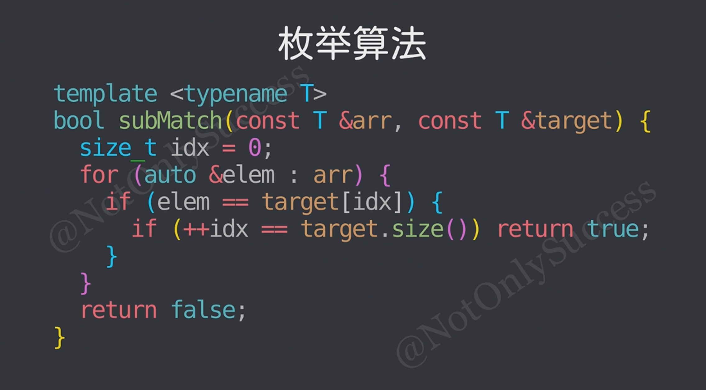
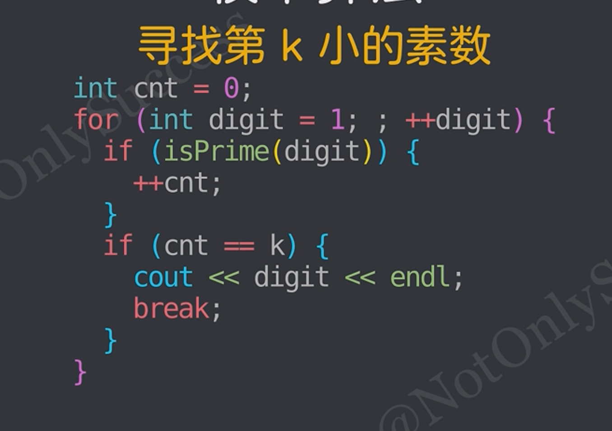
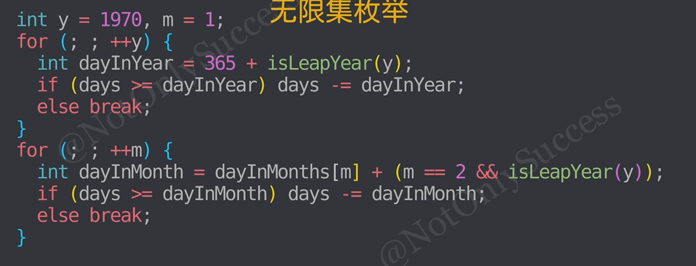
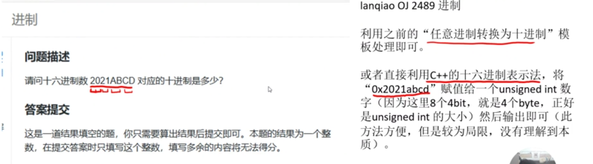

## 基础算法_
### 前缀和

* prefix表示前缀和，由一个用户输入的数组生成
  * prefix为预处理算法，只适用于静态数组，一边修改一边查询需要使用树状数组或线段树等
```c++
prefix[i] = E(i,j=1)a[j]
prefix[i] = E(i-1,j=1)a[j] + a[i]
```

```c++
//可以用于快速生成prefix：
a[0]=0; 
for(int i=1;i<=n;i++){
	prefix[i] = prefix[i-1]+a[i]
}

```

```c++
//可以O(1)的求数组a的一段区间的和
sum(l,r) = prefix[r]-prefix[l-1]
```

```cpp
for(int i=1;i<=n;i++){
  prefix[i]=prefix[i-1]+a[i];
}
```
### 差分
```c++
diff[i] = a[i]-a[i-1];
```

* 对差分数组做前缀和可以还原为数组:
```c++
diff[1] = a[1];
diff[2] = a[2]-a[1];
//...
diff[n] = a[n]-a[n-1];

prefix[n] = E(i,j=1)a[j]
```
利用差分数组可以实现快速的区间修改，将区间[l,r]都加上x：
```c++
diff[l] += x;
diff[r+1] -= x;
```
再做前缀和恢复原数组即可。
差分数组不能实现边修改边查询，只能实现多次修改后多次查询。

差分的实现：
```c++
a[0]=0;
for(int i=1;i<=n;i++){
	diff[i] = a[i]-a[i-1];
}
diff[l] += x;
diff[r+1] -= x;
```
[text](../C++/2-基础算法/差分/差分-区间更新.cpp)

### 递归
* 递归终止条件（基本情况）+递归表达式（递归调用）
  * 将大问题分解为规模更小的子问题，递归调用解决每个子问题，递归终止来借宿递归
  * 避免不必要的重复计算，通过记忆化/剪枝优化递归
  * 考虑边界条件，有时候递归出口不止一个

  * 可以用来处理复杂的数据结构和算法，如树和图的遍历
  * 存在栈溢出风险，栈空间一般只有8MB,一般不超过1e6层
  * 适合处理线性动态规划问题，问题的规模没有明显的缩减，需要特定的迭代次数
  * 适合处理大部分动态规划问题
[斐波那契数列](../C++/2-基础算法/递归/fib（递归）.cpp)

！！！！未完待续！！！！

### 离散化
把无限空间中的有限的个体映射到有限的空间中去，一次提高算法的时空效率。

将数组的值域雅安所，更加关心素元素的大小关系。
要求数组内部有序，一般是去重的。

可以直接通过离散化下标得到值，也能通过值得到离散化下标（通过二分实现）

离散化不会单独考察，一般结合树状数组、线段树、二维平面的计算几何等一起考察。

### 贪心

### 枚举
枚举 != 遍历/暴力
适用范围： 
* 规模小，解空间可枚举的情况。

解空间的类型：
* 一个范围内的所有数字，二元组、字符串等
* (解空间树，子集树和排列树，需要用回溯法进行枚举)

循环枚举解空间：
* 首先确定解空间的维度，及问题中需要枚举的变量个数。

基础枚举模型：

* any_of是否存在, all_of全部都, find_if找到第一个, none_of全部都不
* min_element, max_element, accumulate 
* 通过bool变量flag朴素实现，or 函数实现 or 使用STL
子串匹配枚举：

* 寻找子数组等于目标
* find_if枚举到idx为数组长度

无限集枚举：
eg1.寻找第k小的素数

eg2.计算n天后的日期

* 在无线集中枚举，同时维护关键信息

枚举优化：
* 裁剪枚举集
* eg1.回文串枚举前一半
* eg2.判断素数枚举到n^1/2

按位枚举算法：(本质上是进制转换)
```c++
//10进制的按位枚举
//1.while
while (x){
    int digit=x%10;
    //do something...
    x/=10;
}
//2.for
for (;x;x/=10){
    int digit=x%10;
    //do something...
}
```
```c++
//Base进制的按位枚举
//1.while
while (x){
    int digit=x % Base;
    //do something...
    x/=base;
}
//2.for
for (;x;x /= Base){
    int digit=x%base;
    //do something...
}
```
### 单调性枚举

### 双指针
用于数组或字符串中查找/匹配/排序/移动
一般用两个变量表示下标
#### 对撞指针
* left和right分别指向序列的第一个元素和最后一个元素
  * l不断递增，r不断递减，直到相撞或者错开或者满足其他特殊条件
  * 常用于解决有序数组或者字符串问题
    eg.回文串判断
```c++
#include <bits/stdc++.h>
using namespace std;
const int N=1e6+7;
int main(){
	char s[N];
	ios::sync_with_stdio(0)；
	cin.tie(0),cout.tie(0);
	
	cin>>s+1;
	int l=1,r=strlen(s+1);
	bool ans=true;
	while(l<r){
		if(s[l]!=s[r])ans=false;
		l++,r--;
	}
	cout<<(ans?'Y':'N')<<endl;
	return 0;
}
```
#### 快慢指针
* 两个指针从同一侧开始便利序列，而且移动的补偿一个快一个慢
  * 快指针为r，满指针为l
  * 两个指针以不同速度不同策略一拆散，直到快指针移动到数组尾端，或者两只真相交/其他特殊条件
  * 使用两个指针，一般l=1，r=0 ，初始区间[l,r]=[1,0]表示空区间
    eg.1372美丽的区间
```c++
#include <bits/stdc++.h>
using namespace std;
const int N=1e6+7;

int main(){
	ios::sync_with_stdio(0)；
	cin.tie(0),cout.tie(0);
	
	int n,S;cin>>n>>S;
	for(int i=1,j=0,sum=0;i<=n;++i){
		//区间不合法，移动指针||j有移动空间且没有比s大，移动指针
		while(i>j ||(j+1<=n&&sum<S))sum+=a[++j];
		if(sum>=S)ans=min(ans,j-i-1);//和满足条件，更新答案，更新答案最小，j-1-i为此时区间大小
		sum-=a[i];
	}
	//ans>n不存在，输出0
	cout<<(ans>n?0:ans)<<'\n';
	return 0;
}
```
eg.1621挑选子串
```c++
#include <bits/stdc++.h>
using namespace std;
const int N=2e5+7;
int a[N];
int main(){
	ios::sync_with_stdio(0)；
	cin.tie(0),cout.tie(0);
	
	int n,m,k;cin>>n>>m>>k;
	for(int i=1;i<=n;++i)cin>>a[i];
	
	for(int i=1,j=0,cnt=0;i<=n;++i){
		//区间不合法，移动指针||j有移动空间且没有比s大，移动指针
		while(i>j ||(j+1<=n&&cnt<k))cnt+=(a[++j]>=a);
		if(cnt>=k)ans+=n -i-1;
		cnt-=(a[i]>=n);
	}
	cout<<ans<<'\n';
	return 0;
}
```
### 构造

### 位运算
#### 按位与 &
同真才为真，两个数按位与运算，数不会变大
#### 按位或 |
一真即为真，两个数按位或运算，数不会变小
#### 异或 ^
同假才为假，数可以变大，变小或不变；
位宽不变；
满足性质：交换律，结合律，自反性x^x=0,x^0=x,逆运算：x^y=z则有z^y=x（两边^y可得）
#### 按位取反 ～
常用于无符号整数，避免符号位造成干扰
#### 按位移动
注意不要移动到符号位置上，左移动n位相当于乘以2的n次方，右移相反
按位右移会最高位自动补1,要用unsigned int
#### 位运算技巧
1. x&1=1 ==> 奇数 ，否则位偶数
   2. x>>i & 1 ==> 取二进制中的第i位
   3. x|(1<<i)==> 修改某一位位1
   4. lowbit(x)==x&-x 获取二进制中的最低位的1
      eg.x=(010010),lowbit(x)=(000010)常用于树状数组当中
   5. x&(x-1) ==> 快速判断一个数字是否为2的次方 /如果x是2的次方，则x的二进制表示中只有一个1,x-1就有很多个连续的1而且和x的1没有焦急，x和x-1的与运算就一定为0
#### 拆位算贡献

### 进制转换
k进制的数组转化为10进制：
```c++
ll x;
for(int i=0;i<n;i++){
  x=k*x+a[i];
}
cout<<x<<'\n';
```
k进制数组通常通过字符串处理得到

10进制转换为k进制：

1. 转换成 A-Z (如 Exel 题)当余数范围是 $0 \sim 25$ 时：
```c++
C++res += (char)('A' + remainder); 
```
2. 转换成 16 进制 (0-9, A-F)16 进制比较特殊，因为它混合了数字和字母：
```c++
if (remainder < 10) 
    res += (char)('0' + remainder); // 0-9 映射到 '0'-'9'
else 
    res += (char)('A' + (remainder - 10)); // 10-15 映射到 'A'-'F'
```
3. 纯数字进制转换 (如 2 进制、8 进制)通常不需要字符转换，直接操作 int 数组即可：
```c++
a[++cnt] = remainder; // 直接存数字
```

```c++
ll x;
cin>>x;
int cnt=0;
while(x){
  a[++cnt]=x%k;
  x/=k;
}
reverse(a,a+cnt);
for(int i=0;i<n;i++){
  cout<<a[i]<<'\n';
}
```
```c++
string res = "";
    while (n > 0) {
        n--; // 关键步骤：将 1-26 转为 0-25
        res += (char)('A' + (n % 26));
        n /= 26;
    }
```


### 高精度算法
* C/C++用字符数组/字符串模拟，大数组尽量不要动态分配，尽量定义为全局静态数组。
  * 字符数组占用空间小，整型数组为char的4倍。字符数组读入数据方便，scanf或gets计科，整型数组要用%1d逐个读取，存入整型数组每个元素当中。
  * 全局变量在编译的时候会自动初始化为0，局部变量不可以省略初始化。因此全局静态数组不需要初始化为0。
  * 大数组（大于1w）不能定义在函数内部，可能会栈溢出。局部变量栈空间小。
  * 1MB--25w的数组
  * Py/Java可直接计算
  * 蓝桥杯为单组数据。
  1. 数据对齐：正数个位对其，实数小数点对齐。字符串反转
  2. 字符串转换
  3. 非有效数据置零（读入前进行）

```c
 a[i]=0; 
 a[i]='\0';
 memset(s,0,sizeof(a));
 ```

#### 高精度加法
输出（注意i>0，使得0能正常输出）
##3 高精度除法
* 高精度/单精度
  * 单精度/高精度

计算方法：以字符串接受高精度，转换为数字后储存在字符数组中，从高位到低位处理，模拟除法计算。

