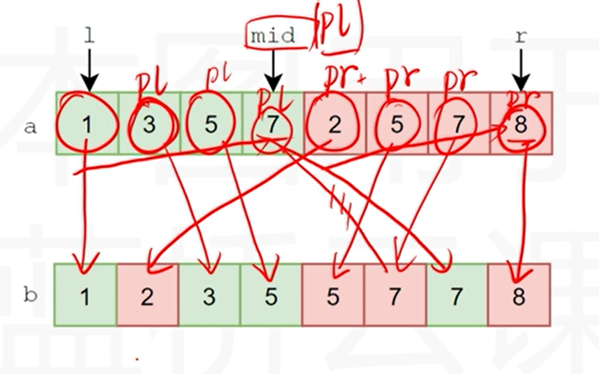
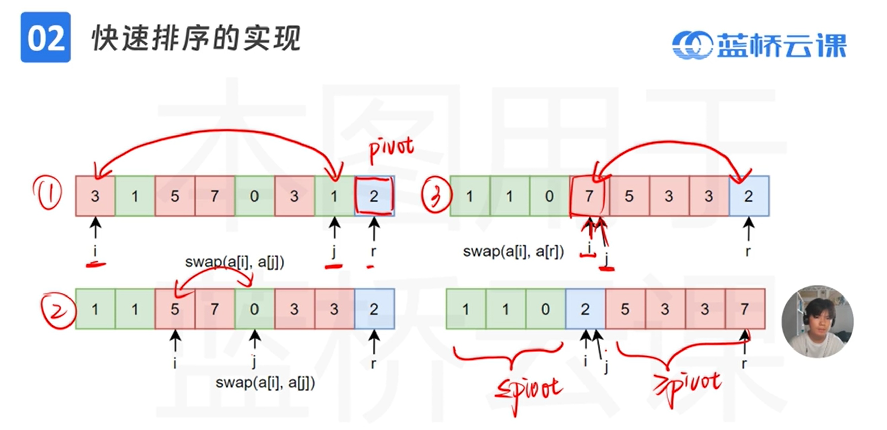

## 排序
### 桶排序

```c++
const int MAXN=5e5+7;

int bucket[MAXN];
void bucket_sort(int a[],int n){
	for(int i=0;i<n;i++){ //遍历数组，将数组元素放到对应桶中
		int x;x=a[i];
		if(x<MAXN)bucket[x]++;  //桶中元素数量++
	}
	for(int i=0;i<=MAXN;i++){
		for(int j=1;j <= bucket[i];j++){ 
			cout<<i<<" ";
		}
	}
}
```

### 选择排序
时间复杂度：O(n^2)
```c++
//大数沉底
void select_sort(int a[],int n){
	for(int i=n-1;i>0;i--){/*要选择的次数:0~n-2共n-1次*/
		int max_id=0;
		for(int j=1;j<=i;j++){
			if(a[j]>a[max_id]){
				max_id=j;
			}
		}if(a[max_id]!=i)swap(a[max_id],a[i]);/*如果max在循环中改变了,就需要交换数据*/
	}
}
```
```c++
//小数提前
void select_sort(int a[],int n){
	for(int i=0;i<n-1;i++){/*要选择的次数:0~n-2共n-1次*/
		int max_id=0;
		int min_id=i;
		for(int j=i+1;j<n;j++){
			if(a[j]<a[min_id]){
				min_id=j;
			}
		}
		if(a[min_id]!=i)swap(a[min_id],a[i]);/*如果min在循环中改变了,就需要交换数据*/
	}
}
```

### 归并排序

核心思想：分治
```c++
void merge_sort(int a[],int l,int r){
	if(l==r)return; //递归出口：当区间大小为1时，直接返回
	int mid=(l+r)/2;
	//左右部分分别排序：
	merge_sort(int a[],l,mid);
	merge_sort(int a[],mid+1,r);

	int pl=l,pr=mid+1,pb=l; 
	//pl为左半边的下标,pr为右半边的下标，b为数组b的下标
	//a: 1 | 3 | 5 | 7 | 2 | 5 | 7 | 8
	//   l          mid              r

	//将a[lr]一个个放入b[lr]当中：
	while(pl<=mid || pr<=r){
		if(pl>mid){ //左半边已经放完：
			b[pb++]=a[pr++];//右边直接放
		}else if(pr>r){ //右半边已经放完：
			b[pb++]=a[pl++];//左边直接放
		}else{
			//两边都有元素，取个小的放到b里
			if(a[pl] < a[pr]){
				b[pb++]=a[pl++];
			}else{
				b[pb++]=a[pr++];
			}
		}
	}
	//合并后将b复制回a：
	for(int i=l;i<r;i++){
		a[i]=b[i];
	}
}
```
### 快速排序
时间复杂度：O(nlogn)，不需要额外空间

核心思想：分治

```c++
int Partition(int a[],int l,int r){
	int pivot=a[r];//以a[r]为基准点，partition会将a[r]放到正确位置上
	int i=l,j=r;

	while(i<j){
		while(i<j && a[i]<=pivot)i++;
		//循环后，i>=j或者a[i]>pivot，==>说明找到了要交换的位置

		while(i<j&&a[j]>=pivot)j--;
		//循环后，i>=j或者a[i]<pivot，==>说明找到了要交换的位置

		//若i<j,则存在a[j]<pivot
		if(i<j)swap(a[i],a[j]);
		//否则a[r]<=pivot,a[i]>=pivot
		else swap(a[i],a[r];)
	}
}
void quick_sort(int a[],int l,int r){
	if(l<r){
		int mid=Partition(a,l,r); //将区间内某个基准数放到正确的位置，并返回该位置

		quick_sort(a,l,mid);//对基准点左边的数再执行快速排序
		quick_sort(a,mid+1,r);//对基准点右边的数再执行快速排序
	}

}
```

### 插入排序
时间复杂度：O(n^2)
输入:数组名称(即数组首地址)、数组中元素个数

指针式写法：
```c++
void insert_sort(int *a, int n){
	for (int i=1; i<n; i++) //i表示当前要确定的位置,下标从1开始因为一个数显然有序，不需要排序。
    {
		int val=*(a+i); //暂存下标为i的数。
    	for (int j=i-1; j>=0 && val <*(a+j); j--) //j=i-1是下标i左边的数,与之对比大小找插入位置。
    	{
        	*(a+j+1) = *(a+j);
        	//如果满足条件就往后挪，让出空位。最坏的情况就是t比下标为0的数都小,它要放在最前面,j==-1,退出循环
    	}
    	*(a+j+1) = val; /*找到下标为i的数的放置位置*/
	}
}
```
数组式写法：
```c
void insert_sort(int a[],int n){
	for (int i=1; i<n; i++)//i表示当前要确定的位置,下标从1开始因为一个数显然有序，不需要排序。
	{ 
		int val=a[i]; //暂存下标为i的数。
		for (int j=i-1; j>=0 && val < a[j]; j--)   //j=i-1是下标i左边的数,与之对比大小找插入位置。
		{  
			a[j+1]=a[j];
			//如果满足条件就往后挪，让出空位。最坏的情况就是t比下标为0的数都小,它要放在最前面,j==-1,退出循环
		}
		a[j+1] = val; /*找到下标为i的数的放置位置*/
	}
}
```

### 渗透建堆
```c++
//输入:数组名称、参与建堆元素的个数、从第几个元素开始
void sift(int *x, int n, int s){
  int t, k, j;
  t = *(x+s); /*暂存开始元素*/
  k = s;   /*开始元素下标*/
  j = 2*k + 1; /*右子树元素下标*/
  while (j<n){
    if (j<n-1 && *(x+j) < *(x+j+1)){ /*判断是否满足堆的条件:满足就继续下一轮比较,否则调整。*/
      j++;
    }
    if (t<*(x+j)){ /*调整*/
      *(x+k) = *(x+j);
      k = j; /*调整后,开始元素也随之调整*/
      j = 2*k + 1;
    }else{  /*没有需要调整了,已经是个堆了,退出循环。*/
      break;
    }
  } 
  *(x+k) = t; /*开始元素放到它正确位置*/
}
```

### 堆排序
```c++
//输入:数组名称、数组中元素个数
void heap_sort(int *x, int n){
  int i, k, t;
  //int *p;
  for (i=n/2-1; i>=0; i--){
    sift(x,n,i); /*初始建堆*/
  } 
  for (k=n-1; k>=1; k--){
    t = *(x+0); /*堆顶放到最后*/
    *(x+0) = *(x+k);
    *(x+k) = t;
    sift(x,k,0); /*剩下的数再建堆*/ 
  }
}

```

### 希尔排序
```c++
//输入:数组名称、数组中元素个数
void shell_sort(int *x, int n)
{
  int h, j, k, t;
  for (h=n/2; h>0; h=h/2) /*控制增量*/
  {
    for (j=h; j<n; j++) /*这个实际上就是上面的直接插入排序*/
    {
      t = *(x+j);
      for (k=j-h; (k>=0 && t<*(x+k)); k-=h)
        {
        *(x+k+h) = *(x+k);
        }
      *(x+k+h) = t;
    }
  }
}
```
### 冒泡排序
```c++
#include<stdio.h>

int bubble_sort_1(int a[],int n){
	int swap_count=0; //冒泡次数计数器
	for(int i=0;i<n-1;i++){
		int swapped=0; //是否交换标记
		for(int j=0;j<n-1-i;j++){
			if(a[j]>a[j+1]){  //升序排序
				int tmp = a[j];
				a[j] = a[j+1];
				a[j+1] = tmp;
				swapped=1; //已交换
				swap_count++;
			}
		}
		if(!swapped)break; //若该轮未交换，则已经顺序，提前结束生剩余的轮
	}
	return swap_count;
}
//仅写法不同，效率相同，遍历方向不同
void bubble_sort_2(int a[],int n) {
	int swap_count=0;
    for (int i=n-1;i>0;i--) {
		int swapped=0;
        for (int j=0;j<i;j++) {
            if (a[j]>a[j+1]) {  //升序排序
                int tmp=a[j];
                a[j]=a[j+1];
                a[j+1]=tmp;
				swapped=1;
				swap_count++;
            }
        }
		if(!swapped)break;
    }
	return swap_count;
}
int main(void){
	int n,a[101];
	while(scanf("%d",&n)!=EOF){ //多组数据输入，n为单组数据个数
		for(int i=0;i<n;i++){
			scanf("%d",&a[i]);
		}
		bubble_sort(a,n);
		for(int i=0;i<n;i++){
			printf("%d ",a[i]);
		}
		printf("\n");
	}
	return 0;
}
```
### 下沉式冒泡排序
```c++
//输入:数组名称、数组中元素个数
//记录最后一次交换位置，动态缩小遍历范围
void bubble_sort_optimized(int *arr, int arr_len) {
    // 外层循环：unsorted_right 表示当前未排序部分的右边界（初始为数组最后一个元素下标）
    for (int unsorted_right = arr_len - 1; unsorted_right > 0; unsorted_right = last_swap_pos) {
        //   current_idx: 当前遍历的下标
        //   last_swap_pos: 记录本轮最后一次发生交换的下标（初始为0，若未交换则直接终止外层循环）
        for (int current_idx = 0, last_swap_pos = 0; current_idx < unsorted_right; current_idx++) {
            // 升序排序：前一个元素 > 后一个元素 则交换
            if (*(arr + current_idx) > *(arr + current_idx + 1)) {
                // 交换相邻元素（指针写法，等价于 arr[current_idx] 和 arr[current_idx+1]）
                int tmp = *(arr + current_idx);
                *(arr + current_idx) = *(arr + current_idx + 1);
                *(arr + current_idx + 1) = tmp;
                // 更新最后一次交换的位置：current_idx之后的元素已有序
                last_swap_pos = current_idx;
            }
        }
    }
}
```
* 注意比较和交换的都是a[j]