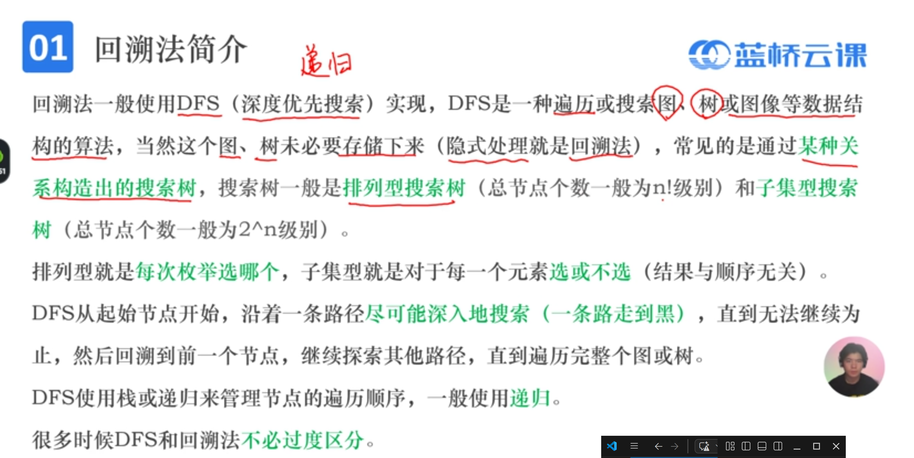
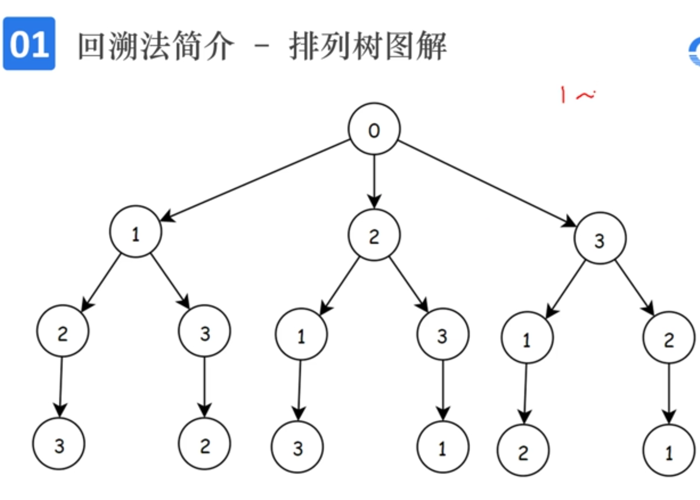
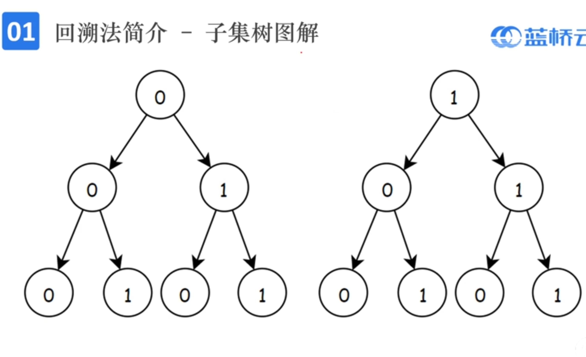

## 查找算法
### DFS回溯




```c++
//求1-n的全排列
const int N=1e5;
int a[N]
bool vis[N];  //用来表示数字i是否被使用过
void dfs(int dep){
  if(dep==n+1){ //深度到达n+1,已经搜索完毕，直接输出结果
    for(int i=1;i<=n;++i)cout<<a[i]<<' ';
    return ;
  }
  for(int i=1;i<=n;++i){ //枚举范围
    if(vis[i])continue; //排除不合法的路径

    vis[i]=true;//修改状态
    a[dep]=i;

    dfs(dep+1); //下一层

    vis[i]=false; //恢复现场
    //a[dep]=0;可以省略
  }
}
```
### DFS剪枝

* 将搜索过程中不必要的部分剔除
* 往往先写一个暴力搜索，然后找到某些特殊的数学或者逻辑关系，通过他们的约束让搜索树尽可能浅而小，从而降低时间复杂度


```c++
//2942数字王国之军训排队
#include <bits/stdc++.h>
using namespace std;
const int N=15 ;//
int a[N],n;
vector<int> v[N];
//可以分到cnt个队伍
bool dfs(int cnt,int dep){
    //若所有人都分完了
    if(dep==n+1){
        //检查合法性
        for(int i=1;i<=cnt;++i){
            for(int j=0;j<v[i].size();++j){
                for(int k=j+1;k<v[i].size();++k){
                     if(v[i][k]%v[i][j]==0)return false;
                }
            }
        }
        return true;
    }
    //枚举每个人所属的队伍
    for(int i=1;i<=cnt;++i){
        v[i].push_back(a[dep]);
        if(dfs(cnt,dep+1))return true;
        //恢复现场
        v[i].pop_back();
    }
}
int main(){
    cin>>n;	//输入待分组学生个数
    for(int i=1;i<=n;++i)cin>>a[i];	//输入n个学生名称
    sort(a+1,a+1+n);
  	for(int i=1;i<=n;++i){	//从分1组开始从小遍历到n组，寻找到最小的break
        if(dfs(i,1)){	//可以分到i队中，从第一个同学开始分
            cout<<i<<'\n';
            break;
        }
    }
    return 0;
}
```

```c++
    //2942数字王国之军训排队
    #include <bits/stdc++.h>
    using namespace std;
    const int N=15 ;//
    int a[N],n;
    vector<int> v[N];
    bool dfs(int cnt,cin dep){
        if(dep==n+1){  
            return true;
        }
        //枚举每个人所属的队伍
        bool tag=true;
            for(const auto &j:v[i])if(a[dep]%j==0){
             tag=false;
                break;
            }
            if(!tag)continue;
        for(int i=1;i<=cnt;++i){
            v[i].pushback(a[dmp]);
            if(dfs(cnt,dep+1))return true;
            //恢复现场
            v[i].pop_back();
        }
    }
    int main(){
        cin>>n;
        for(int i=1;i<=n;++i)cin>>a[i];
        sort(a+1,a+1+n);
        for(int i=1;i<=n;++i){
            if(dfs(i,1)){
                cout<<i<<'\n';
                break;
            }
        }
        return 0;
    }
```


### 记忆化
将搜索过程中会重复计算而结果相同的部分保存下来，作为一个状态，
下次访问到这个状态时直接将这个子搜索的结果返回，而不需要重新计算一遍

通常是同数组或map来记忆化，下表一般和dfs的参数表对应。

需要保证重复计算的结果是相同的，否则可能产生数据失真。

```c++
    #include <iostream>
    #include <iomanip>
    using namespace std;
    using ll = long long;
    const int N =1e5+9;
    
    ll dp[N];
    
    ll fib(int n){
        if(dp[n])return dp[n]; //带备忘录的递归
        if(n==1 || n==2){ //if(n <= 2){
            return 1;
        }else{
            return dp[n] = fib(n-1)+fib(n-2);
        }
        
    }
    int main(){
        int n;
        cin>>n;
    
        for(int i=1;i<=n;i++){
            cout<<fib(i)<<endl;
        }
        return 0;
    }
```

## 查找
### 二分查找
```c++
//从数组中找两个数，和等于m
//F1：遍历+剩余二分
//F2：双指针/尺取法O(n)

//二分答案

```