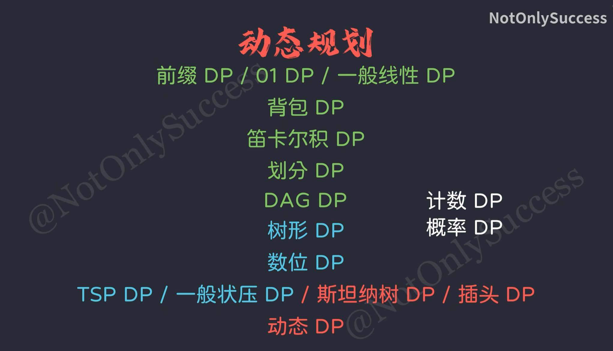

## 动态规划

### 动态规划基础
```c++
//数组初始化
//写法一，声明为全局变量，会自动初始化为0
//只能用来初始化0或-1
int dp[N][N];
memset(dp,-1,sizeof(dp));
//如果值可能为-1，可以开一个bool数组
bool calced[N][N];
//写法二
vector<vector<int>> dp(N,vector<int>(N,-1));
//C++17类模板写法
auto dp = vector(n,vector(n,-1));
```

### 三种遍历方式
* 从左到右全部遍历，条件判断 0、1 和一般情况
*  0 和 i 单独遍历
* 从左到右全部遍历，条件判断 !=0 和 !=i 
### 三种写法
* 当前状态可以由那些状态而来
> 初始化初始状态
> 
> 枚举每个状态（不包括初始状态）
> 
> 从一计算的其他状态通过状态转移方程计算当前状态

* 当前状态可以到哪里去
> 初始化初始状态
> 
> 枚举每个状态（不包括目标状态）
> 
> 计算当前状态转移后的新状态的值，作为新状态的一个可行方案

* 从目标状态反推
> 枚举所有的目标状态
>
> dfs递归找到可计算的初始状态
> 

#### LCS最长公共子序列

```
//用dp[i] [j]表示A[1 ~ i],B[1~2]的最长公共子序列列长度
```


状态转移方程为：

```c++
    if(a[i]=b[j]){
        dp[i][j]=dp[i-1][j-1]+1;
    }else{
        do[i][j]=max(dp[i-1][j],dp[i][j-1]);
    }
```


```c++
//LQ1189
    
```


#### LIS最长上升子序列
从一个序列中按照原顺序选出若干个不一定连续的元素组成的序列

* 朴素LIS模型
  用dp[i]表示序列1-i中以a[i]结尾的最长上升子序列的长度

  状态转移方程为:

```c++
  dp[i]=max(dp[j]+1),if(a[i]>a[j])
```

```c++
  //LQ2049
```

* eg.LQ749合唱队形

```c++

```

* 二分实现LIS

#### 二维DP

```c++
//LQ389
```

```c++
//LQ3711
```

#### 线性DP

DP动态规划——将复杂问题分解为重叠的子问题，通过子问题解的整个问题的解

状态：dp[i][j]=val的取值，用于描述、确定状态所需要的变量

状态转移：状态之间的转移关系，一般可以表达为一个数学表达式，转移方向决定迭代或递归方向

最终状态：题目所求的状态，即为最终的答案

1. 确定状态，到第i个为止，xx为i的方案数/最小代价/最大价值。可以根据数据范围和复杂度来推理。
2. 确定状态转移方程，即从抑制状态得到新状态的方法，并确保按照这个方向一定可以正确的得到最终状态，根据状态转移的方向，来确定石笋迭代还是递归（记忆化）。
3. 确定最终装状态并输出

```c++
//LQ1536数字三角形
 
```

```c++
//LQ3367破损的楼梯

```

```c++
//LQ3423安全序列

```
#### 前缀DP

#### 区间DP


#### 期望DP

#### 区间DP

#### 01DP

### 背包DP
#### 01背包
* 01背包
* ```c++
  ```
*
* 01背包的优化
* ```c++
  ```
*

### 树形DP